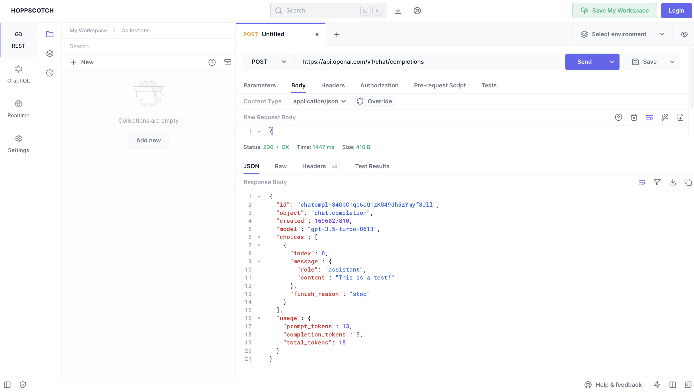
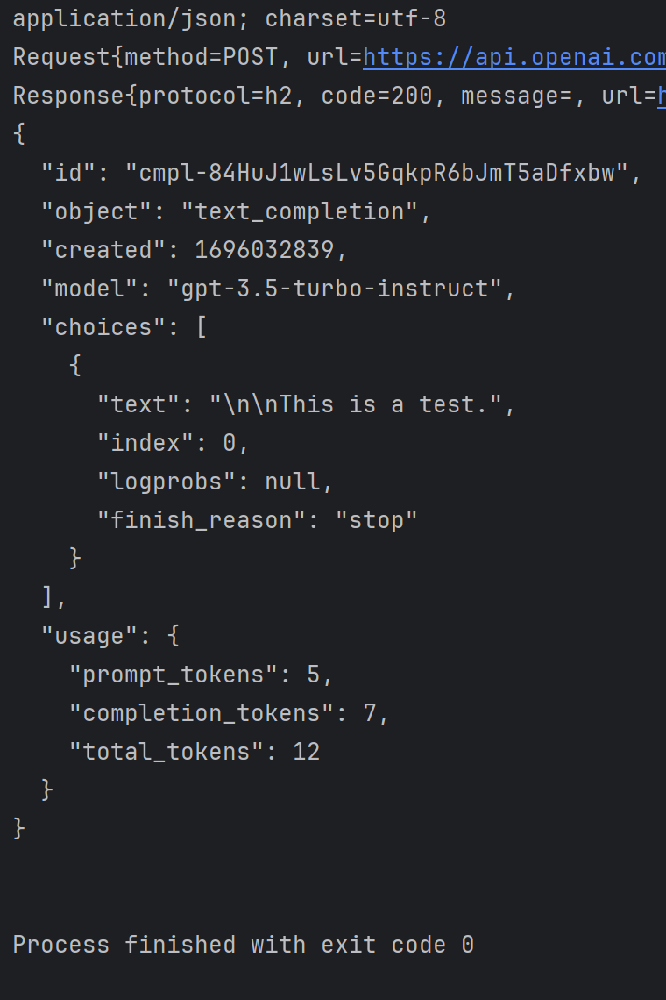

# CSC207_Project
Main repository for the CSC207 Group Project!

## Problem Domain
Our primary problem domain is motivation and goal achievement, especially in relation to
lifestyle. This domain encompasses a few key points and problems:

1. Motivation Erosion: Users often struggle to maintain their motivation over time. They may start enthusiastically but 
gradually lose interest in pursuing their goals. The challenge is to provide consistent and effective motivation to 
prevent this erosion.

2. Goal Setting and Tracking: Many individuals have difficulty setting clear and achievable goals. Additionally, they may 
struggle with tracking their progress toward these goals. The app needs to assist users in setting SMART (Specific, 
Measurable, Achievable, Relevant, Time-bound) goals and tracking their journey.

3. Maintaining Engagement: Keeping users engaged with the app is a significant challenge. Users might lose interest if 
they perceive the app's content as repetitive or unhelpful. Ensuring that the app continues to provide value and 
motivation is vital to providing an effective lifestyle changing solution to the above problems.

## Description

Our team aims to create a goal setting/tracking app using OpenAI API to create AI generated 
motivational and reminder messages that are both personalized to the user, and kept unique and 
diversified to stop them from becoming mundane and ineffective. Users will have the ability to set 
long term, short term, and daily goals for themselves with appropriate deadlines if the user 
likes. The app will then provide timely motivational messages and reminders to encourage the 
user to complete their goals. Users will also be able to see and track their progress on the 
goals they're working on or view a history of the goals they have completed or were unable to 
complete. Additionally, our app will implement gamification elements such as achievement badges 
and progress visualization to reinforce users for completing and working on their goals and
maintain app engagement.

## Link to the documentation 

https://platform.openai.com/docs/api-reference/introduction 

## Using a tool to try out OpenAI

## Example Java output

